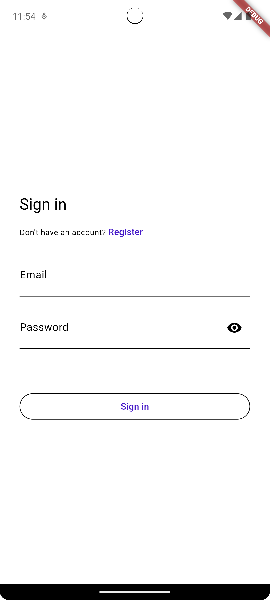
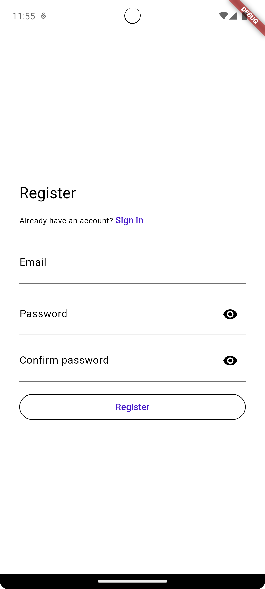
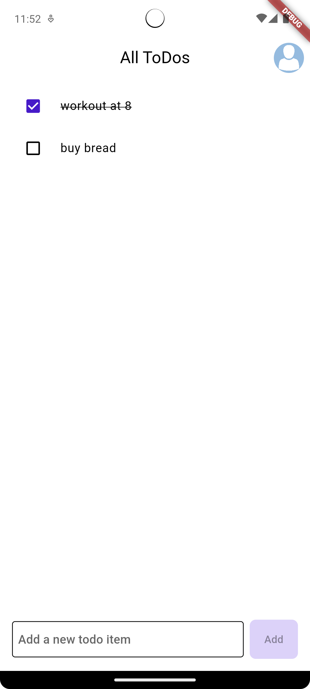
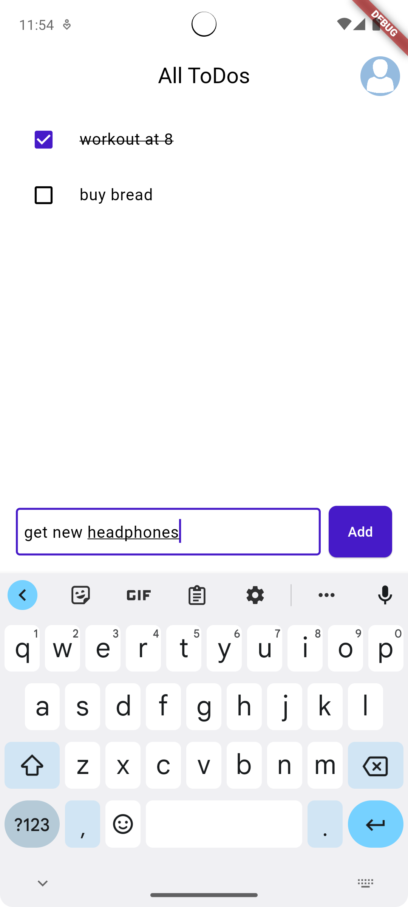
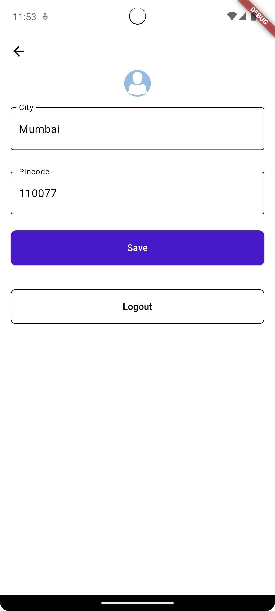

# TODO

Flutter and Firebase app for managing your To-Do list.

## Features:
- User authentication with email and password
- Add to-do items
- Mark items as done
- Profile page with user info
- Logout

## Technologies used:
- Flutter for the mobile app
- Firebase as the serverless backend, with Firestore for the database and Firebase Authentication for user authentication.
- Riverpod for state management and dependency injection

## Cloud Firestore structure:
```
- users (collection)
    - user_id (document)
        - name
        - email
        - todos (subcollection)
            - todo_id (document)
                - title 
                - isCompleted
```

- Collection `users` contains documents with `user_id` as the document id.  
This `user_id` is the same as the `uid` provided by Firebase Authentication.
- Each document contains the user's information like their name, email, etc.  
- Along with information, it contains a subcollection `todos` which contains documents with `todo_id` as the document id.   
- Each document in the `todos` collection contains information of the todo item like the title of the to-do item and a boolean `isCompleted` which is true if the item is marked as done.
        
## Future Scope that can be added:
- Sharing lists with other users
- Collaborating on lists with other users along with providing access control
- Deleting items
- Adding due dates to items
- Adding reminders
- Search functionality
- Adding tags to items

## Screenshots:












